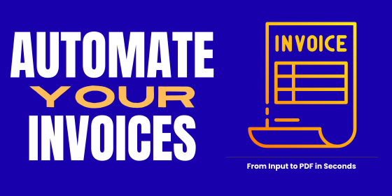
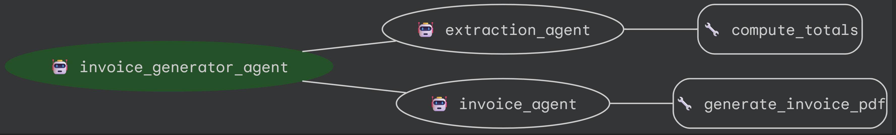

# Invoice Generator Agent


[](https://github.com/Diana1928/multi-agent-invoice-generator/blob/main/LICENSE)

## Project Overview
This project automates invoice creation by extracting structured data from natural language input and formatting it into a professional PDF invoice.



## Problem Statement
Manual invoice creation is time‑consuming and error‑prone. It often requires copying data from spreadsheets, emails, or handwritten notes, then formatting each invoice from scratch. This process can lead to:
- Human errors in totals and dates
- Delayed payments due to slow processing
- Wasted administrative time

For small and mid‑sized businesses with limited staff, these inefficiencies directly impact cash flow. Automating invoice generation reduces errors, speeds up billing cycles, and improves overall financial operations.


## Solution Statement
This project automates invoice generation using AI agents:
1. Users provide invoice details in **natural language**.
2. The system extracts structured JSON data.
3. A PDF invoice is generated automatically and returned to the user.


## Architecture



### Root Agent
- **`root_agent`** orchestrates the workflow.
- Delegates tasks to specialized sub‑agents.
- Ensures the sequence: **extraction → invoice creation → PDF output**.

### Sub‑Agents
- **`extraction_agent`**  
  Parses natural language input into structured JSON invoice data and validates totals.
- **`invoice_agent`**  
  Converts JSON data into a formatted PDF invoice.

### Tools
- **`compute_totals`** → Calculates subtotal, tax, and total.  
- **`generate_invoice_pdf`** → Generates the final invoice in PDF format.  
- **Memory Utilities** → Sessions are automatically saved for continuity.


## Workflow
1. User provides invoice details in natural language.  
2. `extraction_agent` converts the input into structured JSON and validates totals.   
3. `invoice_agent` takes the JSON and generates a PDF invoice.  
4. The file path of the generated invoice is returned to the user.  


## Value Statement
By automating invoice creation, this agent reduced my weekly invoice preparation time by 5 hours, freeing me to focus on higher‑value tasks.

### Future Improvements
- Add an **email agent** to send invoices directly.  
- Integrate with **QuickBooks** or other accounting software.  
- Expand extraction to handle **scanned documents or photos**.  


## Installation

This project was built using **Python 3.11.3**.  

1. Create a virtual environment
```bash
python -m venv .venv
source .venv/bin/activate   # On Linux/Mac
.venv\Scripts\activate      # On Windows
```

2. Install dependencies
   
```bash
pip install -r requirements.txt
```

## Running the Agent in ADK Web Mode
From the project directory, run
```bash
adk web
```

## Project Structure
This project is structured as follows:

- invoice_agent/: Main Python package
  - agent.py: Defines root_agent and orchestrates sub-agents
  - config.py: Configuration (models, retry options, memory)
  - tools.py: Custom tools (totals, PDF generation)
  - memory_utils.py: Session/memory handling
  - sub_agents/: Contains the sub-agents
    - extraction_agent.py: Extracts structured JSON from user input
    - invoice_agent.py: Generates PDF invoices

